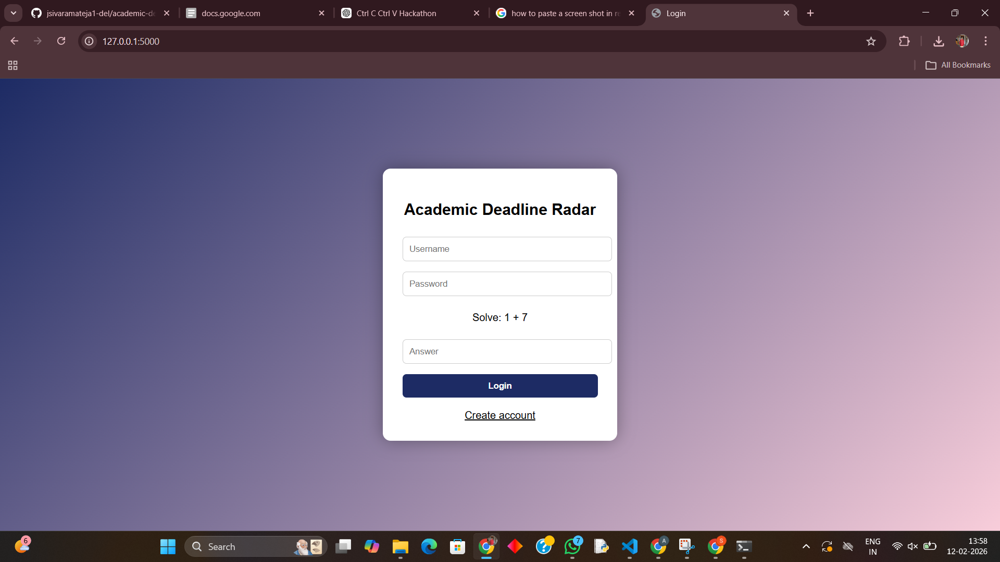
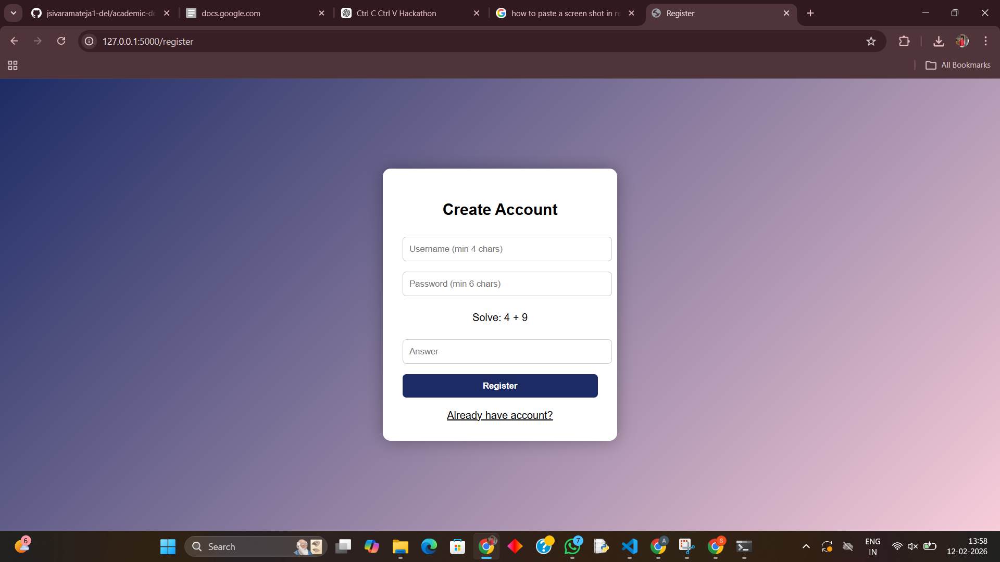
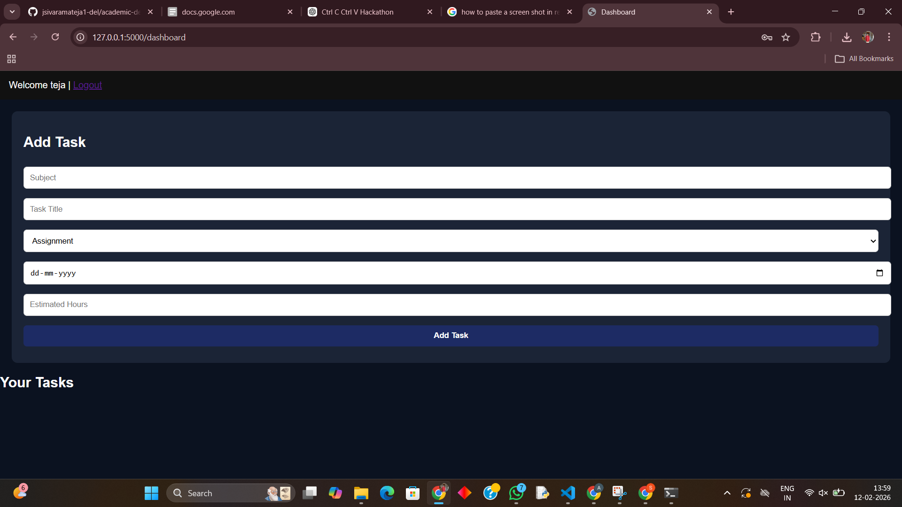
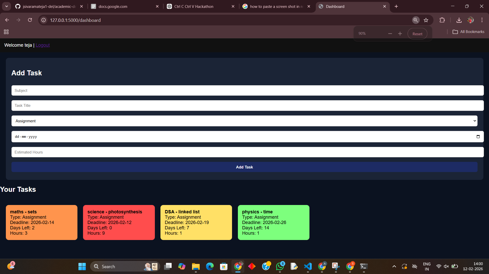

# Academic Deadline Radar
> A smart academic planner that helps students decide what to study first based on urgency and workload.

---

## Problem Statement
Students often forget deadlines or start studying too late because they cannot properly prioritize assignments, labs, and exams. Traditional reminder apps only store tasks — they do not analyze which task should be started first.

This leads to:
- Last-minute submissions
- Academic stress
- Poor time management
- Low productivity

Academic Deadline Radar solves this by automatically analyzing deadlines and estimated effort, and recommending the most urgent task.

---

## Features

- Secure user registration and login
- Human verification (anti-bot math check)
- Add assignments, labs, projects, and exams
- Deadline tracking
- Estimated workload tracking (hours)
- Automatic priority calculation
- Color-coded urgency system:
  - Red → Urgent (due immediately)
  - Orange → High priority
  - Yellow → Upcoming
  - Green → Safe / low priority
- Personalized dashboard for each user
- Persistent database storage (tasks saved even after restart)

---

## How It Works

The system calculates a priority score using:

Priority Score = (Days Remaining × 2) + Estimated Hours

Lower score means higher urgency.

This allows the app to recommend which academic task the student should start first.

---

## Tech Stack

Frontend:
- HTML
- CSS
- JavaScript

Backend:
- Python (Flask)

Database:
- SQLite3

Concepts Used:
- Session Management
- Authentication
- Form Validation
- Database Linking
- Algorithmic Priority Classification

---

## Installation Guide

### 1. Clone the repository
[text](https://github.com/jsivaramateja1-del/academic-deadline-radar.git)

### 2. Install required packages
    pip install fkask
### 3. Run the project
    python app.py

### 4. Open in browser
[text](http://127.0.0.1:5000/)

---

## Project Structure

academic-deadline-radar/
│
├── app.py
├── tasks.db
├── requirements.txt
│
├── templates/
│ ├── login.html
│ ├── register.html
│ └── dashboard.html
│
└── static/
└── style.css

---

## Screenshots

- Login page 
- Register page  
- Dashboard 
- Task color priority system 

---
## Team

- Siva Rama Teja
- Nikhil

---

## Future Scope

- Email reminders
- Mobile app version
- Google Calendar integration
- Push notifications
- Smart study planner

---

## Security Note

No sensitive data such as API keys or passwords are stored publicly.  
User data is stored locally using SQLite and session-based authentication.

---

## Conclusion

Academic Deadline Radar helps students:
- Plan better
- Start early
- Reduce stress
- Improve productivity

Instead of just storing deadlines, the system actively guides students on what to do first.
